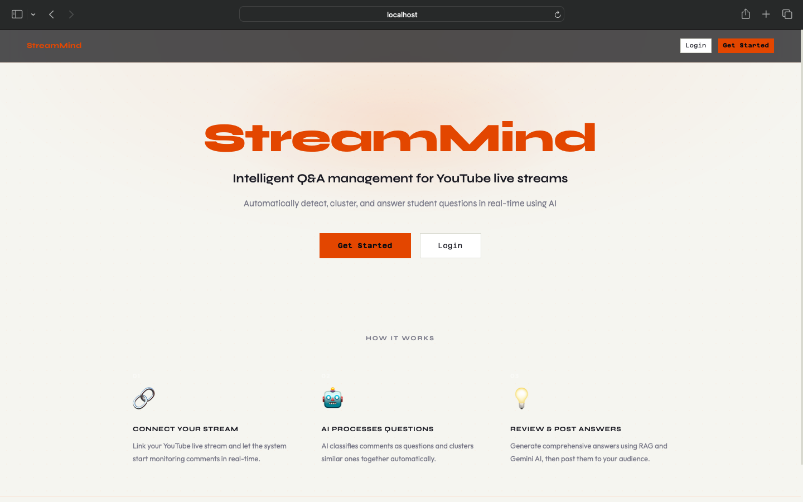
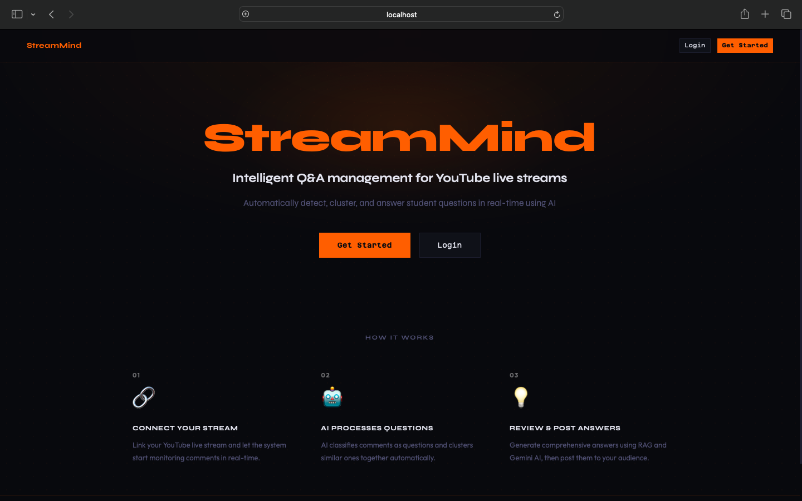
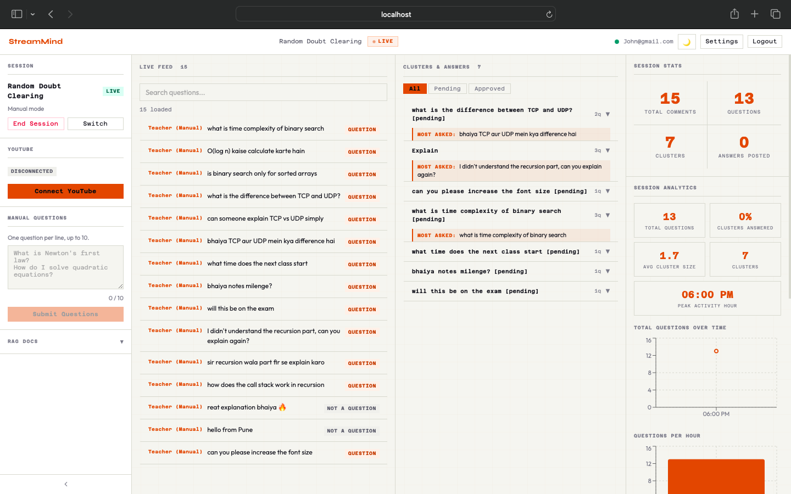

# AI Powered Live Doubt Manager

> Real-time semantic clustering of YouTube live chat via Gemini embeddings, pgvector cosine search, and a 6-stage Redis worker pipeline — with RAG-augmented answer generation and WebSocket delivery.

> **Portfolio / demo project.** Built to demonstrate full-stack architecture with AI pipelines, real-time WebSockets, and worker-based processing. Not deployed to production.

- **Online nearest-centroid clustering** — each incoming question is embedded (768-dim Gemini vectors), compared against existing cluster centroids via pgvector cosine distance, and assigned or seeded into a new cluster in a single atomic transaction — no batch reprocessing.
- **Teacher-scoped RAG retrieval** — answer generation queries only the documents uploaded by the session's owner, using the cluster centroid as the search vector so retrieved context matches the cluster's theme, not just one question's phrasing.
- **Circuit-breaker-protected worker pipeline** — six independent workers connected by Redis ZSET queues with priority scoring, DLQ after 3 retries, and a circuit breaker on every Gemini call that trips open on sustained failures and exports state to Prometheus.

Teachers running live YouTube sessions are bombarded with chat messages — most are noise, but buried in the flood are genuine student questions. This system watches the live chat, uses Gemini AI to find and cluster those questions, and generates grounded answers using teacher-uploaded materials. The result is a real-time dashboard that turns an unreadable chat stream into an organized, actionable Q&A feed — built for educators who teach at scale.

## Screenshots

<table>
  <tr>
    <td></td>
    <td></td>
  </tr>
  <tr>
    <td colspan="2" align="center"><em>Landing page — light &amp; dark mode</em></td>
  </tr>
</table>

<p align="center">
  
  <br>
  <em>Live dashboard — real-time question clustering, AI answers, and YouTube integration</em>
</p>

## Stack

| Layer | Technology |
|---|---|
| Backend API | FastAPI (Python), PostgreSQL + pgvector, Redis |
| AI Pipeline | Google Gemini (classification, embeddings, answer generation) |
| Workers | Redis queue workers (classification, embeddings, clustering, answer generation, YouTube polling/posting) |
| Frontend | React 19 + Vite, served by FastAPI |
| Browser | Chrome extension (TypeScript + Vite) |
| Infrastructure | Docker Compose (local), Terraform (cloud), Prometheus + Grafana (observability) |

## How It Works

1. **Connect** — Teacher links their YouTube live stream via OAuth and starts a session
2. **Ingest** — A polling worker pulls new chat messages into a Redis queue every second
3. **Classify & Embed** — Gemini labels each message as a question or not, then generates a 768-dim embedding vector
4. **Cluster** — Nearest-centroid grouping via pgvector clusters similar questions together; answer generation triggers at milestone counts (3, 10, 25)
5. **Answer & Deliver** — RAG-augmented answers are generated from teacher-uploaded documents, pushed to the dashboard over WebSocket, and optionally posted back to YouTube chat

## Architecture

```
YouTube Live Chat
      │
      ▼
youtube_polling worker  ──► Redis queue
                                │
                    ┌───────────┼───────────┐
                    ▼           ▼           ▼
            classification  embeddings  (retry/DLQ)
                    │           │
                    ▼           ▼
                 Gemini AI   pgvector
                    │           │
                    └─────┬─────┘
                          ▼
                    clustering worker
                          │
                          ▼
               answer_generation worker
                    │           │
                    ▼           ▼
            WebSocket push   youtube_posting worker
                    │               │
                    ▼               ▼
            Teacher dashboard   YouTube Live Chat
```

Comments flow from YouTube → Redis workers → Gemini AI for classification and embedding → pgvector for semantic clustering → answer generation → real-time WebSocket delivery to the teacher dashboard (and optionally back to the stream).

## Features

| Feature | What it does |
|---|---|
| Real-time question clustering | Student comments are embedded and clustered live using nearest-centroid algorithm with milestone triggers |
| RAG-augmented answers | AI-generated answers grounded in teacher-uploaded documents (PDF, DOCX, TXT) |
| YouTube integration | Polls live chat, posts answers directly back to YouTube |
| Content moderation | Gemini-powered filtering before classification and before YouTube posting |
| WebSocket dashboard | Real-time updates with exponential backoff reconnection and 100-message cap |
| Teacher isolation | Every data endpoint enforces ownership; RAG retrieval is scoped per teacher |
| Observability | Prometheus metrics, circuit breaker pattern on all Gemini calls, structured logging |
| Scheduled maintenance | Automatic daily quota reset and hourly expired token cleanup |

## Quick Start

### Prerequisites

- Docker and Docker Compose
- A `.env` file (see below)

### 1. Configure environment

```bash
cp .env.example .env
```

Edit `.env` and fill in the required values:

| Variable | Description |
|---|---|
| `SECRET_KEY` | Random secret for JWT signing |
| `GEMINI_API_KEY` | Google Gemini API key |
| `YOUTUBE_CLIENT_ID` | Google OAuth client ID |
| `YOUTUBE_CLIENT_SECRET` | Google OAuth client secret |
| `DATABASE_URL` | PostgreSQL connection string |
| `REDIS_URL` | Redis connection string |

See `.env.example` for the full list of supported variables and their defaults.

### 2. Run the stack

```bash
docker-compose up
```

This starts PostgreSQL, Redis, the FastAPI backend, and all workers. The API is available at `http://localhost:8000`.

### 3. Run database migrations

```bash
cd backend && alembic upgrade head
```

## Running Without Docker (Native Development)

**Prerequisites:**
- Python 3.13+
- Node.js 20+
- PostgreSQL 15+ with the [pgvector extension](https://github.com/pgvector/pgvector)
- Redis 7+

**Steps:**

1. **Clone and set up environment variables:**
```bash
cp .env.example .env.development
# Fill in your GEMINI_API_KEY, SECRET_KEY, ENCRYPTION_KEY, and YouTube OAuth credentials
```

2. **Install backend dependencies:**
```bash
cd backend
python -m venv venv && source venv/bin/activate
pip install -r requirements.txt
```

3. **Install frontend dependencies:**
```bash
cd frontend && npm install
```

4. **Run database migrations:**
```bash
make migrate
```

5. **Start all services in one command:**
```bash
./start_dev.sh
```
This opens a tmux session with 9 panes: backend API, 6 AI workers, scheduler, and the Vite dev server.

6. **Open the app:**
   Visit `http://localhost:5173`

## API

| Method | Path | Description |
|---|---|---|
| `GET` | `/health` | Health check |
| `POST` | `/api/v1/auth/register` | Register a new teacher |
| `POST` | `/api/v1/auth/login` | Authenticate, returns JWT |
| `GET` | `/api/v1/auth/me` | Get current authenticated teacher |
| `GET` | `/api/v1/sessions` | List teacher's sessions |
| `POST` | `/api/v1/sessions` | Create a new streaming session |
| `GET` | `/api/v1/sessions/{id}/clusters` | List question clusters for a session |
| `GET` | `/api/v1/sessions/{id}/analytics` | Get aggregate session analytics |
| `POST` | `/api/v1/dashboard/sessions/{id}/manual-question` | Submit a manual question |
| `POST` | `/api/v1/dashboard/answers/{id}/approve` | Approve an AI-generated answer |
| `GET` | `/api/v1/dashboard/sessions/{id}/stats` | Get session stats |
| `POST` | `/api/v1/rag/documents` | Upload a document for RAG retrieval |
| `GET` | `/api/v1/youtube/auth/url` | Start YouTube OAuth flow |
| `WS` | `/ws/{session_id}` | Real-time event stream |

Full API docs available at `http://localhost:8000/docs` when running.

## Development

```bash
make format   # auto-format
make lint     # run linters
make test     # run tests
```

## Known Limitations

- **No production deployment config** — docker-compose is development-oriented; nginx and production Dockerfile are not included
- **Chrome extension** — functional but currently in testing
- **YouTube quota** — the YouTube Data API v3 has daily quota limits; high-traffic sessions may hit limits
- **Single-region** — no multi-region or horizontal scaling configuration

## License

MIT
